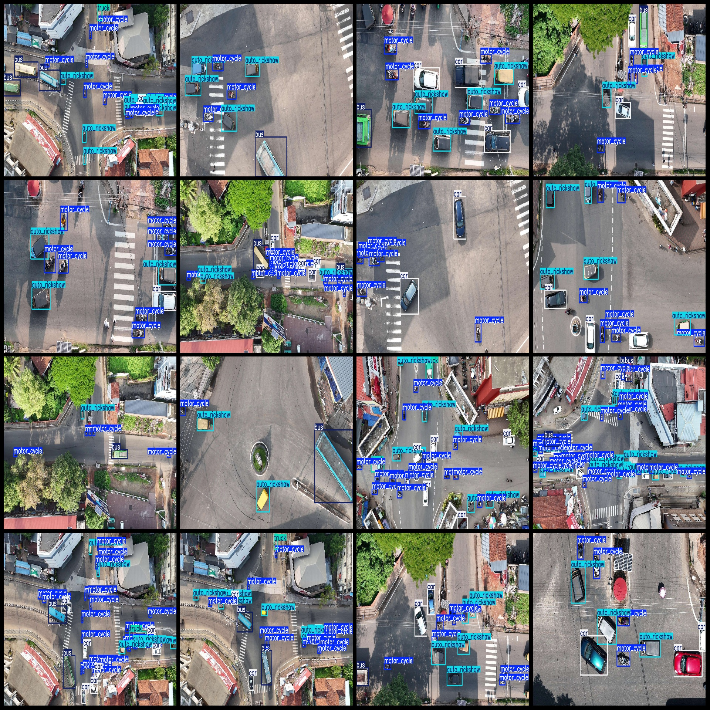
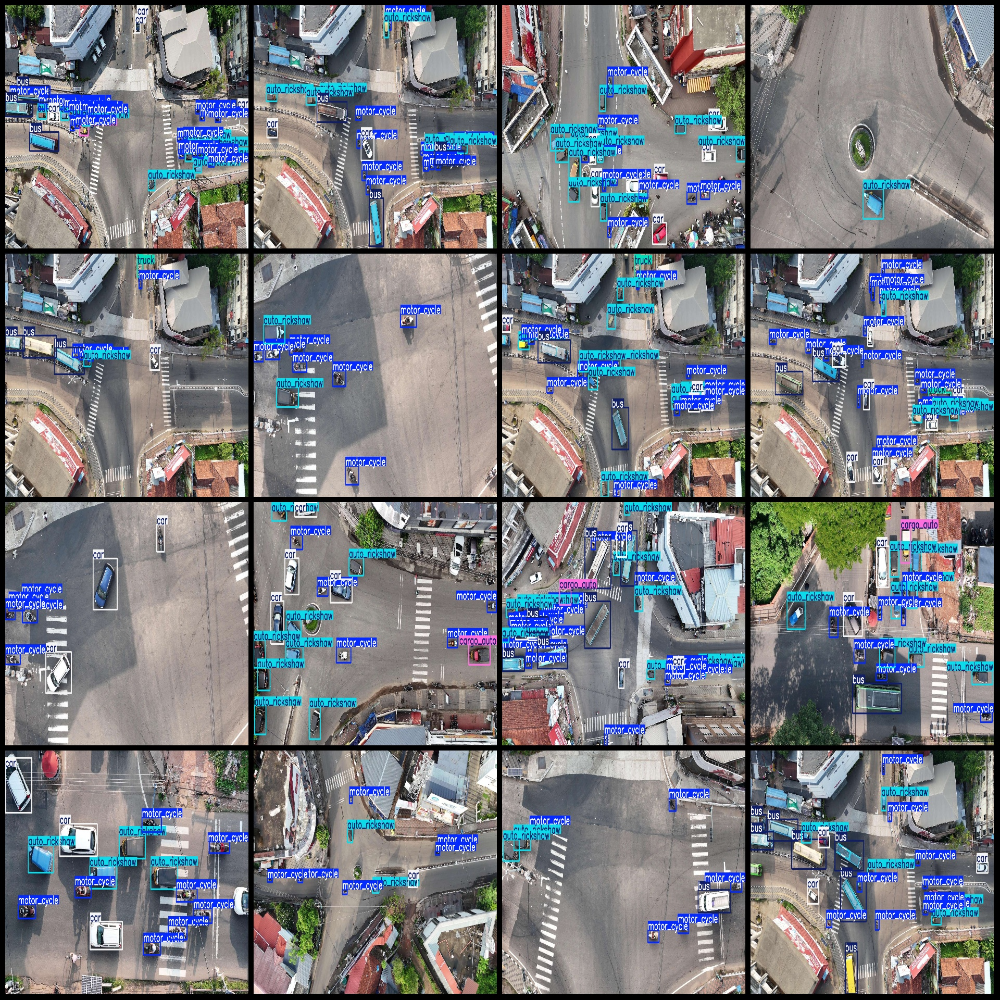

# UAV Viewpoint City Street Vehicles, Three-Wheelers, Motorcycles Detection Dataset VOC+YOLO Format 1534 Images 6 Classes

```
Pascal VOC format + YOLO format (without split path in txtfile, only containing jpgimage and corresponding VOC format xmlfile and yolo format txtfile)
```
number of images: 1534  
annotation count: 1534  
The number of txt files is 1534.
The number of categories is 6.
Annotation class names: ["auto_rickshaw", "bus", "car", "cargo_auto", "motor_cycle", "truck"]
boxes per class:   
Autorickshaw box count = 9144
The number of buses on a route is 1953.
"carbox count = 5458"

The sentence is incomplete and seems to be a mathematical expression or a statement, but it lacks the necessary context to determine its meaning. If "car" refers to a specific type of car, then "box count = 5458" could be an indication of the number of boxes that contain the specific type of car. Without additional information, it's impossible to provide a complete translation or interpretation of the sentence.
Cargo_auto is a 3-wheeled cargo vehicle with a box count of 496.
Motorcycle box count = 16630
The number of truck frames is 496.
The total number of frames is 34177.
images per class:   
1424 images of auto rickshaws  
882 images of buses
The number of car images is 1327.
The cargo_auto ("cargo tricycle") has a possession count of 402.
Motorcycle images = 1499  
Truck images = 432
The resolution of the image is 1920x1080.
Unmanned Aerial Vehicle: DJI MAVIC 3
The height of the collection is 50-100 meters.
Capture Angle: 90°  
Using annotation tool: labelImg  
Annotation rules: draw a rectangle around the class.
Important note: The dataset does not have separate training, validation, and test sets to be split.
Special Notice: The dataset does not guarantee the accuracy of the trained model or weight files.
Image preview:
## Images




Here is a pay link on Stripe ( https://buy.stripe.com/3cs8yP7sY87d0vu9AB ). Please contact me lonlonago@foxmail.com after funding $89, and I will send you a complete data files , thank you!

